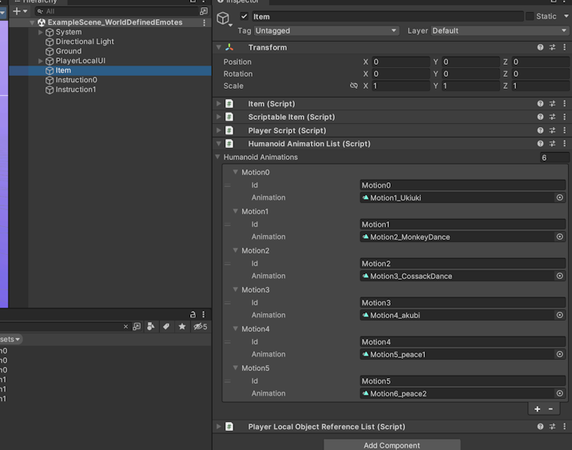

# BaxterClusterAC2024

[Cluster Advent Calendar 2024](https://qiita.com/advent-calendar/2024/cluster) で紹介しているClusterワールドのプロジェクトです。

説明についてはnoteを参照下さい。

(TBD: ここにnoteのURLを追記予定です)

このプロジェクトに対してモーションのセットアップを行って公開しているワールドは以下から見られます。

https://cluster.mu/w/7a772547-0942-468a-9845-b8f4bede7b87

## プロジェクト内容について

- `Assets/Baxter/Scene/ExampleScene_WorldDefinedEmotes.unity` がサンプルシーンです。
- `Assets/Baxter/ClusterScripts` 以下がスクリプトとして実装しているものです。

## ワールドのアップロードを試す場合に必要なセットアップについて

公開版のワールドでは下記BOOTHで配布されるモーションを使用していますが、このレポジトリには含まれません。

https://booth.pm/ja/items/1065089

そのため、とくにサンプルシーンで `Item` オブジェクトの `HumanoidAnimationList` コンポーネントについて、AnimationClipが未割り当てになります。(下記は割当済みの例です)

手元からワールドをアップロードする場合、少なくともこの部分に何かしらのモーションデータを割り当ててからアップロードを試して下さい。

## ライセンスについて

- レポジトリ内のデータであってアバターが映っている画像以外は用途を問わず、かつクレジット表記なく利用して構いません。
- アバターが映り込んでいる画像は操作の説明を目的としていることを前提に、常識の範囲でお使い下さい。
